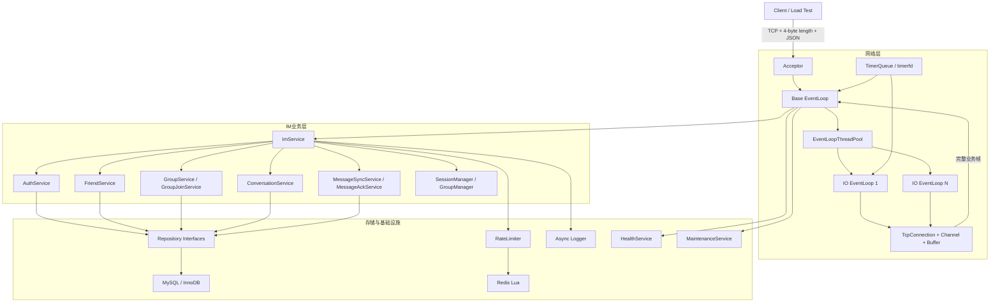
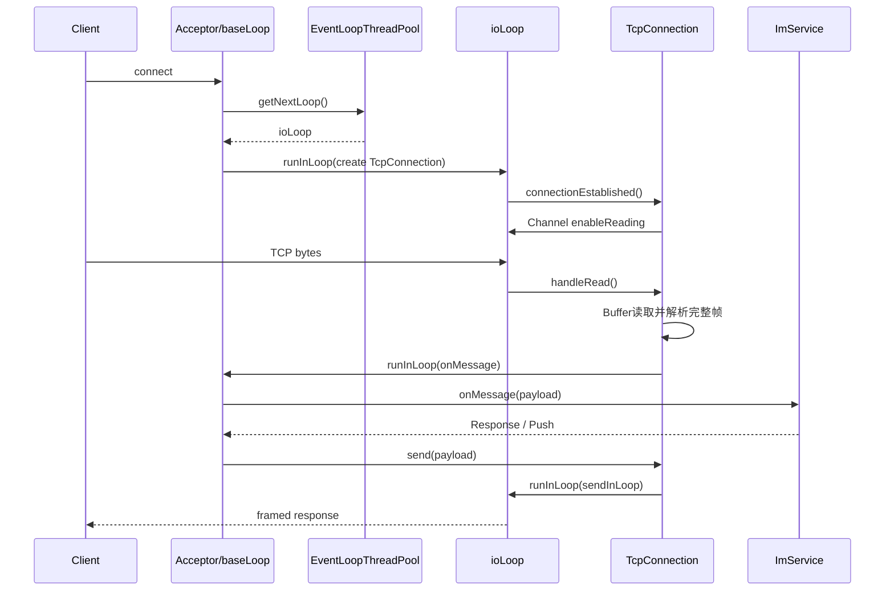
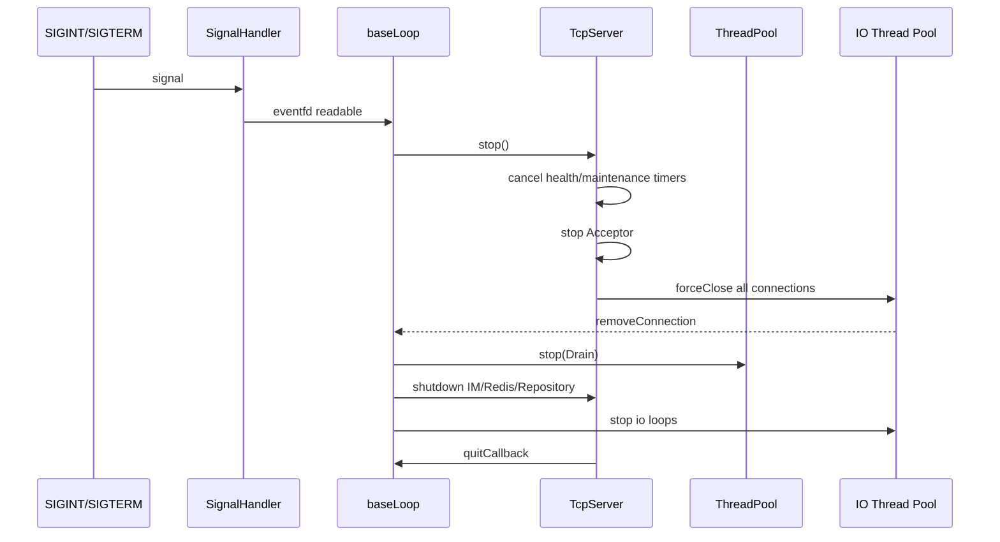

# Project_Chat

C++20 / Linux 即时通信服务端。项目从基础 Reactor 网络库出发，逐步实现账号、好友、群聊、消息持久化、离线消息、增量同步、限流、日志、健康检查和优雅停服等完整链路。

> 当前定位：单机 IM 服务端学习项目，重点展示 Linux 网络编程、并发模型、协议设计、存储抽象、状态一致性和工程化能力，而不是直接用于生产环境。

## 项目亮点

- 基于 `epoll ET` 的主从 Reactor：`baseLoop` 负责接入与业务编排，多个 `ioLoop` 负责连接读写。
- `one loop per thread`：每个 `EventLoopThread` 独占一个 `EventLoop`，减少 Channel 和 Buffer 的共享状态。
- 4 字节大端长度前缀协议，正确处理 TCP 半包与粘包，最大帧长度可配置。
- `eventfd` 实现跨线程唤醒，支持 move-only 回调投递。
- `timerfd + set` 实现定时器队列，支持跨线程添加、取消、重复定时器及回调内取消。
- `TcpConnection` 输出高低水位、硬限制和慢连接丢弃/关闭策略，避免输出缓冲无限增长。
- 有界 `ThreadSafeQueue + ThreadPool`，支持 `Drain / Discard` 停止语义和运行统计。
- 同步/异步日志、结构化上下文、文件与终端 Sink、日志丢弃统计。
- Repository 抽象与 MySQL Connector/C++ 实现，使用 PreparedStatement、事务和连接池。
- Redis Lua 原子限流，覆盖注册、登录失败、发消息、同步和历史消息等关键接口。
- 账号、Token、资料、好友、群组权限、入群审批、私聊/群聊、历史消息、离线索引、ACK、会话列表和增量同步。
- 健康快照、维护任务、SQL/Redis/日志状态采集、信号驱动优雅停服。

## 技术栈

| 分类 | 技术 |
|---|---|
| 语言与构建 | C++20、CMake |
| 网络与并发 | epoll ET、eventfd、timerfd、pthread、std::thread |
| 协议 | 4 字节长度前缀、JSON、协议版本、消息类型码、错误码 |
| 数据库 | MySQL / InnoDB、MySQL Connector/C++ JDBC API、PreparedStatement、事务、连接池 |
| 缓存与限流 | Redis、hiredis、redis-plus-plus、Lua |
| 安全组件 | OpenSSL RAND、SHA-256、Token Hash |
| 工程能力 | 异步日志、配置系统、健康检查、后台维护、优雅停服、ASAN选项、压测工具 |

## 总体架构



## Reactor线程模型



### 线程职责

- **baseLoop**：监听新连接、维护连接映射、串行业务入口、Session/Group内存状态、广播编排、健康与维护定时调度。
- **ioLoop**：所属连接的 `Channel`、fd、输入/输出 Buffer、心跳和实际 socket 读写。
- **后台线程池**：当前主要承担维护任务等后台工作；后续性能优化方向是把同步 SQL、Redis和密码计算从 baseLoop 中进一步解耦。
- **异步日志线程**：批量消费日志队列并写入 Sink，避免业务线程逐条刷盘。

## 网络协议

每个网络帧由固定4字节长度头和JSON载荷组成：

```text
+----------------------+--------------------------+
| uint32 payload_len   | payload_len bytes JSON   |
| network byte order   | UTF-8                    |
+----------------------+--------------------------+
```

接收逻辑：

1. ET模式持续读取，直到返回 `EAGAIN/EWOULDBLOCK`。
2. Buffer不足4字节时等待下次读取。
3. 读取大端长度并校验 `max_frame_len`。
4. 数据不足完整帧时保留在Buffer中，解决半包。
5. Buffer中存在多个完整帧时循环解析，解决粘包。
6. JSON协议层校验 `ver/type/req_id`和业务字段。

响应统一包含：

```json
{
  "ver": 1,
  "type": 33,
  "req_id": 1,
  "ok": true,
  "code": 0,
  "msg": "Ok",
  "data": {
    "msg_id": 123,
    "server_ts_ms": 1760000000000
  }
}
```

## 主要功能

### 账号与资料

- 注册时输入用户名与密码，服务端生成唯一 `accountId`。
- `accountId + password`登录，签发随机Token，数据库仅保存Token Hash。
- Token恢复登录、注销与会话过期/撤销清理。
- 获取和修改昵称、头像URL、签名等资料。

### 好友系统

- 按accountId搜索用户。
- 发起、查询、接受和拒绝好友申请。
- 双向好友关系、删除好友、好友事件推送。
- 好友申请接受使用事务保证申请状态和好友关系一致。

### 群组系统

- Snowflake ID生成群ID。
- 创建、搜索、入群申请、审批、邀请、退群和解散。
- 群主/管理员/普通成员角色。
- 踢人、设置管理员、转让群主及权限校验。
- 服务启动时从Repository恢复群与成员快照。

### 消息链路

- 好友私聊、群聊广播与消息持久化。
- 连接级背压与慢连接保护。
- 私聊/群聊历史消息向前分页和按lastMsgId增量补齐。
- 离线消息索引、批量ACK、消息送达/已读回执。
- 会话摘要、未读数、会话已读和多会话增量同步。

## 目录结构

```text
Project_Chat/
├── client/                  # 命令行测试客户端
├── config/                  # JSON配置
├── include/
│   ├── auth/                # 注册、密码登录、Token登录
│   ├── config/              # 配置类与校验
│   ├── im/                  # IM服务、协议、Session、群组等
│   ├── infra/               # health、maintenance、redis、signal、thread
│   ├── logger/              # Logger、AsyncLogger、Sink
│   ├── security/            # 密码、Token、限流
│   ├── storage/             # Repository抽象、SQL实现、数据类型
│   └── timer/               # Timer、TimerId、TimerQueue
├── server/                  # 服务端入口
├── sql/schema.sql           # MySQL初始化脚本
├── src/                     # 实现文件
├── tools/                   # SQL测试与压测工具
├── docs/                    # 项目面试问答
└── CMakeLists.txt
```

## 环境要求

推荐环境：RHEL系Linux，GCC支持C++20。

- CMake >= 3.15
- GCC/G++（支持C++20）
- OpenSSL开发包
- MySQL Server + MySQL Connector/C++（classic JDBC API）
- Redis Server
- hiredis
- redis-plus-plus

> Connector/C++需要提供CMake目标 `mysql::concpp-jdbc`；redis-plus-plus与hiredis需要能够被CMake在系统include/library路径中找到。

## 初始化MySQL

```bash
mysql -u root -p < sql/schema.sql
```

建议创建专用数据库账号，不要在公开仓库中保存真实密码：

```sql
CREATE USER 'project_chat'@'127.0.0.1' IDENTIFIED BY 'replace-with-strong-password';
GRANT SELECT, INSERT, UPDATE, DELETE ON project_chat.* TO 'project_chat'@'127.0.0.1';
FLUSH PRIVILEGES;
```

## 配置

默认配置路径：`config/config.json`。配置加载后会应用环境变量覆盖。

常用环境变量：

```bash
export SERVER_HOST=0.0.0.0
export SERVER_PORT=8080
export SERVER_IO_THREADS=4

export DB_HOST=127.0.0.1
export DB_PORT=3306
export DB_USER=project_chat
export DB_PASSWORD='replace-with-real-password'
export DB_DATABASE=project_chat
export DB_POOL_SIZE=4

export REDIS_ENABLED=true
export REDIS_HOST=127.0.0.1
export REDIS_PORT=6379
export REDIS_PASSWORD=''
```

安全建议：

- 生产部署只通过环境变量或Secret Manager注入。
- 当前TCP业务协议尚未接入TLS，不应直接暴露到公网。

## 构建

完整构建：

```bash
cmake -S . -B build \
  -DCMAKE_BUILD_TYPE=RelWithDebInfo \
  -DENABLE_SQL=ON \
  -DENABLE_REDIS=ON
cmake --build build -j"$(nproc)"
```

调试ASAN构建：

```bash
cmake -S . -B build-asan \
  -DCMAKE_BUILD_TYPE=Debug \
  -DENABLE_ASAN=ON
cmake --build build-asan -j"$(nproc)"
```

仅构建核心网络与内存存储时可关闭外部依赖：

```bash
cmake -S . -B build-min \
  -DENABLE_SQL=OFF \
  -DENABLE_REDIS=OFF
cmake --build build-min -j"$(nproc)"
```

使用该版本运行前，还需要把 `config/config.json` 中的 `storage.type` 改为 `memory`、把 `redis.enabled` 改为 `false`；否则配置要求与二进制能力不一致。

## 运行

确保MySQL和Redis已经启动，然后在项目根目录执行：

```bash
./build/server
```

命令行客户端：

```bash
./build/client
```

客户端支持的代表性命令包括：

```text
/register <username> <password>
/login <accountId> <password>
/tokenlogin <token>
/dm <accountId> <message>
/gcreate <groupName>
/gjoin <groupId>
/gsayto <groupId> <message>
/gmembers <groupId>
/ghistory <groupId> ...
/offlinelist ...
/offlineack ...
```

客户端只用于开发调试，最新业务接口建议结合前端或专用测试工具验证。

## 压测

```bash
./build/load_test \
  --host 127.0.0.1 \
  --port 8080 \
  --clients 20 \
  --rate 5 \
  --duration 60 \
  --group Group1
```

主要输出指标：

- `sent / ok / timeout / late_resp`
- `connect_fail / auth_fail / join_fail`
- `send_fail / recv_fail / parse_fail`
- `push_recv / dropped_by_server`
- `p50_ms / p95_ms / p99_ms / qps_ok`

群聊压测需要同时区分：

```text
请求吞吐 = 每秒发送到服务端的群消息请求数
投递吞吐 = 请求吞吐 × 实际接收成员数
```

## 优雅停服



## 已知限制与后续优化

- 当前`ImService`和同步Repository调用主要运行在baseLoop；慢SQL或Redis操作可能阻塞业务入口。后续可加入异步执行器，将阻塞I/O放到后台线程，结果再回到baseLoop提交状态。
- 当前密码存储为带随机盐的SHA-256学习实现；生产实现应升级为PBKDF2、scrypt或Argon2id，并使用常量时间比较。
- 业务协议当前未接TLS，密码和Token不应通过公网明文传输。
- 当前是单机连接目录和群状态，尚未实现跨节点连接路由与分布式广播。
- 压测工具和自动化测试仍需继续完善，性能结论必须以固定机器、Release构建和完整报告为准。


## 参考资料

- [Linux epoll(7)](https://man7.org/linux/man-pages/man7/epoll.7.html)
- [Linux eventfd(2)](https://man7.org/linux/man-pages/man2/eventfd.2.html)
- [Linux timerfd_create(2)](https://man7.org/linux/man-pages/man2/timerfd_create.2.html)
- [Linux accept4(2)](https://man7.org/linux/man-pages/man2/accept4.2.html)
- [MySQL Connector/C++文档](https://dev.mysql.com/doc/dev/connector-cpp/latest/)
- [MySQL InnoDB事务](https://dev.mysql.com/doc/refman/8.4/en/commit.html)
- [Redis Lua脚本](https://redis.io/docs/latest/develop/programmability/eval-intro/)
- [OpenSSL RAND_bytes](https://docs.openssl.org/3.5/man3/RAND_bytes/)
