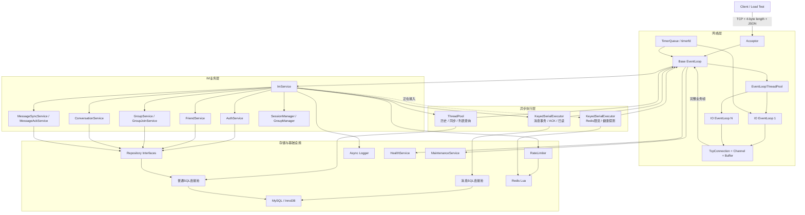
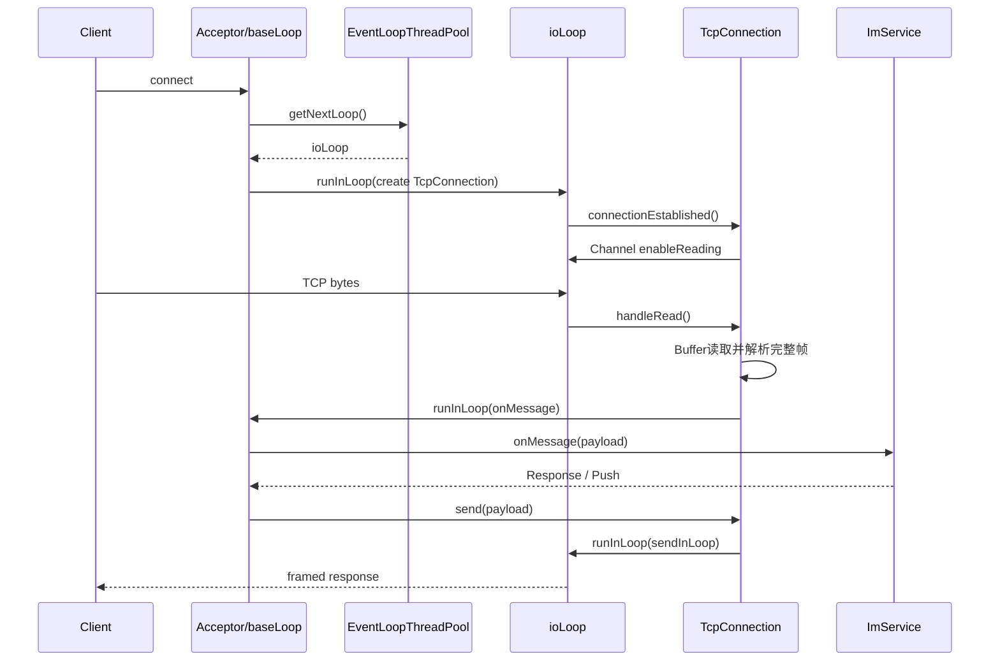
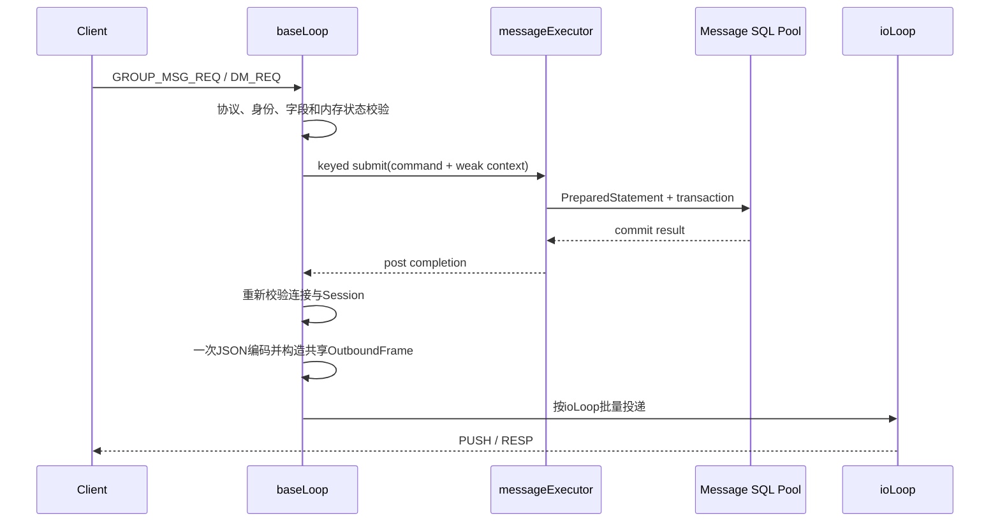
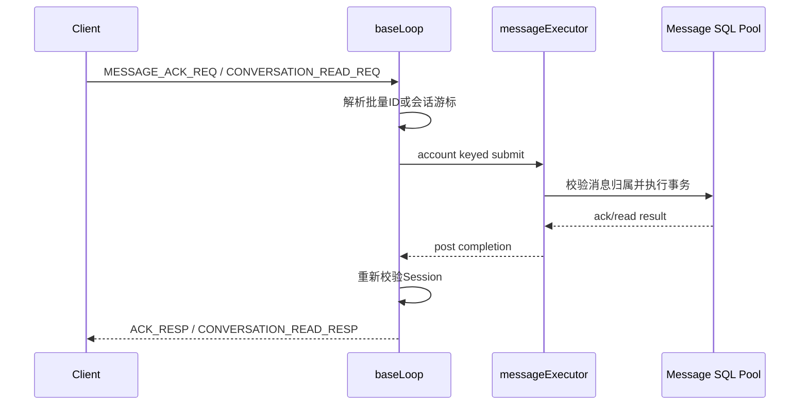
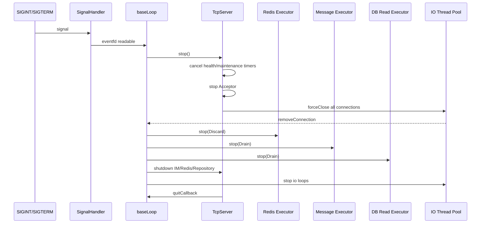

# Project_Chat

C++20 / Linux 即时通信服务端。项目从基础 Reactor 网络库出发，逐步实现账号、好友、群聊、消息持久化、离线消息、增量同步、限流、日志、健康检查和优雅停服等完整链路。

> 当前定位：单机 IM 服务端学习项目，重点展示 Linux 网络编程、并发模型、协议设计、存储抽象、状态一致性和工程化能力，而不是直接用于生产环境。

## 项目亮点

- 基于 `epoll ET` 的主从 Reactor：`baseLoop` 负责接入与业务编排，多个 `ioLoop` 负责连接读写。
- `one loop per thread`：每个 `EventLoopThread` 独占一个 `EventLoop`，减少 Channel 和 Buffer 的共享状态。
- 4 字节大端长度前缀协议，正确处理 TCP 半包与粘包，最大帧长度可配置。
- `eventfd` 实现跨线程唤醒，支持 move-only 回调投递。
- `timerfd + set` 实现定时器队列，支持跨线程添加、取消、重复定时器及回调内取消。
- `TcpConnection` 输出高低水位、硬限制和慢连接丢弃/关闭策略，避免输出缓冲无限增长。
- 有界 `ThreadSafeQueue + ThreadPool`，支持 `Drain / Discard` 停止语义和运行统计。
- `KeyedSerialExecutor` 按业务键分片：同一群、同一私聊会话或同一账号的任务保持有序，不同键并行执行。
- 消息持久化、历史查询、增量同步、消息 ACK 和会话已读已从 `baseLoop` 迁移到独立执行器，完成后回投 `baseLoop` 提交状态与响应。
- 群聊广播复用一次 JSON 编码结果和共享 `OutboundFrame`，再按 `ioLoop` 批量投递，降低大群广播中的重复编码、拷贝和跨线程唤醒。
- 同步/异步日志、结构化上下文、文件与终端 Sink、日志丢弃统计。
- Repository 抽象与 MySQL Connector/C++ 实现，使用事务、通用 SQL 参数绑定、连接池及单连接 LRU PreparedStatement 缓存。
- 普通业务 SQL 与消息事务使用独立连接池，避免历史查询、管理请求与高频消息写入互相抢占连接。
- Redis Lua 原子限流，覆盖注册、登录失败、发消息、同步和历史消息等关键接口。
- 已建立独立 Redis 异步执行器和配置模型；当前正在把同步限流检查与健康 PING 从 `baseLoop` 迁入该执行器。
- 账号、Token、资料、好友、群组权限、入群审批、私聊/群聊、历史消息、离线索引、ACK、会话列表和增量同步。
- 会话已读使用事务统一更新私聊/群聊已读游标、未读数与消息回执，异步完成时重新校验连接和账号身份。
- 健康快照、维护任务、SQL连接池/执行器/Redis/日志状态采集、信号驱动优雅停服。

## 技术栈

| 分类 | 技术 |
|---|---|
| 语言与构建 | C++20、CMake |
| 网络与并发 | epoll ET、eventfd、timerfd、pthread、std::thread |
| 协议 | 4 字节长度前缀、JSON、协议版本、消息类型码、错误码 |
| 数据库 | MySQL / InnoDB、MySQL Connector/C++ JDBC API、PreparedStatement、事务、连接池 |
| 缓存与限流 | Redis、hiredis、redis-plus-plus、Lua |
| 安全组件 | OpenSSL RAND、SHA-256、Token Hash |
| 工程能力 | 有界任务队列、KeyedSerialExecutor、异步日志、配置系统、健康检查、后台维护、优雅停服、ASAN选项、压测工具 |

## 总体架构


```mermaid
flowchart TB
    Client["Client / Load Test"] -->|"TCP + 4-byte length + JSON"| Acceptor

    subgraph Network["网络层"]
        Acceptor --> BaseLoop["Base EventLoop"]
        BaseLoop --> IOPool["EventLoopThreadPool"]
        IOPool --> IO1["IO EventLoop 1"]
        IOPool --> IO2["IO EventLoop N"]
        IO1 --> Conn["TcpConnection + Channel + Buffer"]
        IO2 --> Conn
        Timer["TimerQueue / timerfd"] --> BaseLoop
        Timer --> IO1
    end

    Conn -->|"完整业务帧"| BaseLoop

    subgraph IM["IM业务层"]
        BaseLoop --> ImService["ImService"]
        ImService --> Auth["AuthService"]
        ImService --> Friend["FriendService"]
        ImService --> Group["GroupService / GroupJoinService"]
        ImService --> Conversation["ConversationService"]
        ImService --> Sync["MessageSyncService / MessageAckService"]
        ImService --> Session["SessionManager / GroupManager"]
    end

    subgraph Executors["异步执行层"]
        ImService --> MessageExecutor["KeyedSerialExecutor<br/>消息事务 / ACK / 已读"]
        ImService --> DbReadExecutor["ThreadPool<br/>历史 / 同步 / 列表查询"]
        ImService -.->|"正在接入"| RedisExecutor["KeyedSerialExecutor<br/>Redis限流 / 健康探测"]
        MessageExecutor --> BaseLoop
        DbReadExecutor --> BaseLoop
        RedisExecutor --> BaseLoop
    end

    subgraph Storage["存储与基础设施"]
        Auth --> Repos["Repository Interfaces"]
        Friend --> Repos
        Group --> Repos
        Conversation --> Repos
        Sync --> Repos
        MessageExecutor --> MessagePool["消息SQL连接池"]
        DbReadExecutor --> GeneralPool["普通SQL连接池"]
        Repos --> GeneralPool
        MessagePool --> MySQL["MySQL / InnoDB"]
        GeneralPool --> MySQL
        ImService --> RateLimiter["RateLimiter"]
        RateLimiter --> Redis["Redis Lua"]
        RedisExecutor --> Redis
        Logger["Async Logger"]
        Health["HealthService"]
        Maintenance["MaintenanceService"]
    end

    ImService --> Logger
    BaseLoop --> Health
    BaseLoop --> Maintenance
```

## Reactor线程模型


```mermaid
sequenceDiagram
    participant C as Client
    participant A as Acceptor/baseLoop
    participant P as EventLoopThreadPool
    participant I as ioLoop
    participant T as TcpConnection
    participant M as ImService

    C->>A: connect
    A->>P: getNextLoop()
    P-->>A: ioLoop
    A->>I: runInLoop(create TcpConnection)
    I->>T: connectionEstablished()
    T->>I: Channel enableReading

    C->>I: TCP bytes
    I->>T: handleRead()
    T->>T: Buffer读取并解析完整帧
    T->>A: runInLoop(onMessage)
    A->>M: onMessage(payload)
    M-->>A: Response / Push
    A->>T: send(payload)
    T->>I: runInLoop(sendInLoop)
    I-->>C: framed response
```

### 线程职责

- **baseLoop**：监听新连接、维护连接映射、串行业务入口、Session/Group内存状态、广播编排、健康与维护定时调度。
- **ioLoop**：所属连接的 `Channel`、fd、输入/输出 Buffer、心跳和实际 socket 读写。
- **messageExecutor**：`KeyedSerialExecutor`，处理群聊/私聊持久化、消息 ACK、离线 ACK 和会话已读事务；同一业务键有序，不同键并行。
- **dbReadExecutor**：无顺序要求的有界线程池，处理群聊/私聊历史、离线索引、会话列表和增量同步等查询。
- **redisExecutor**：独立的 `KeyedSerialExecutor` 基础设施已经建立；目标是承载限流、健康 PING 以及后续缓存操作，避免 Redis 延迟影响消息线程池。
- **后台线程池**：承担维护任务等低频后台工作，不用于高频消息持久化和 Redis 限流。
- **异步日志线程**：批量消费日志队列并写入 Sink，避免业务线程逐条刷盘。

## 异步业务流水线

### 执行器划分

| 流水线 | 执行器 | 顺序键 | 当前状态 |
|---|---|---|---|
| 群消息持久化 | `messageExecutor` | `group:<groupId>` | 已接入 |
| 私聊消息持久化 | `messageExecutor` | `dm:<conversationKey>` | 已接入 |
| 消息/离线 ACK | `messageExecutor` | `ack:<accountId>` | 已接入 |
| 会话已读 | `messageExecutor` | 账号级顺序键 | 已接入 |
| 历史、离线、会话和同步查询 | `dbReadExecutor` | 无 | 已接入 |
| Redis限流和健康探测 | `redisExecutor` | `account:<accountId>` / 系统键 | 执行器已建立，业务接入中 |

所有已接入的异步业务都遵循：

```text
baseLoop校验并构造不可变上下文
    → 有界执行器提交
    → 工作线程执行阻塞I/O
    → 回投baseLoop
    → 重新校验连接、ConnKey和accountId
    → 修改内存状态、广播或回包
```

异步完成阶段不会直接信任请求提交时保存的 `Session*`，而是通过弱连接、连接键和账号重新解析当前 Session，避免断线重连或 fd 复用后把旧结果发送给错误连接。

### 消息写入与广播


```mermaid
sequenceDiagram
    participant C as Client
    participant B as baseLoop
    participant M as messageExecutor
    participant SQL as Message SQL Pool
    participant I as ioLoop

    C->>B: GROUP_MSG_REQ / DM_REQ
    B->>B: 协议、身份、字段和内存状态校验
    B->>M: keyed submit(command + weak context)
    M->>SQL: PreparedStatement + transaction
    SQL-->>M: commit result
    M-->>B: post completion
    B->>B: 重新校验连接与Session
    B->>B: 一次JSON编码并构造共享OutboundFrame
    B->>I: 按ioLoop批量投递
    I-->>C: PUSH / RESP
```

消息写入使用独立 SQL 连接池。群消息事务分配群内递增序号，私聊事务校验接收账号和好友关系，并更新双方会话摘要、未读数及离线投递索引。

### ACK与会话已读


```mermaid
sequenceDiagram
    participant C as Client
    participant B as baseLoop
    participant M as messageExecutor
    participant SQL as Message SQL Pool

    C->>B: MESSAGE_ACK_REQ / CONVERSATION_READ_REQ
    B->>B: 解析批量ID或会话游标
    B->>M: account keyed submit
    M->>SQL: 校验消息归属并执行事务
    SQL-->>M: ack/read result
    M-->>B: post completion
    B->>B: 重新校验Session
    B-->>C: ACK_RESP / CONVERSATION_READ_RESP
```

会话已读不是简单把 `unread_count` 置零：私聊会校验消息属于当前会话并推进已读消息ID，群聊维护成员级已读序号；更新过程由事务保证一致性。

## 网络协议

每个网络帧由固定4字节长度头和JSON载荷组成：

```text
+----------------------+--------------------------+
| uint32 payload_len   | payload_len bytes JSON   |
| network byte order   | UTF-8                    |
+----------------------+--------------------------+
```

接收逻辑：

1. ET模式持续读取，直到返回 `EAGAIN/EWOULDBLOCK`。
2. Buffer不足4字节时等待下次读取。
3. 读取大端长度并校验 `max_frame_len`。
4. 数据不足完整帧时保留在Buffer中，解决半包。
5. Buffer中存在多个完整帧时循环解析，解决粘包。
6. JSON协议层校验 `ver/type/req_id`和业务字段。

响应统一包含：

```json
{
  "ver": 1,
  "type": 33,
  "req_id": 1,
  "ok": true,
  "code": 0,
  "msg": "Ok",
  "data": {
    "msg_id": 123,
    "server_ts_ms": 1760000000000
  }
}
```

## 主要功能

### 账号与资料

- 注册时输入用户名与密码，服务端生成唯一 `accountId`。
- `accountId + password`登录，签发随机Token，数据库仅保存Token Hash。
- Token恢复登录、注销与会话过期/撤销清理。
- 获取和修改昵称、头像URL、签名等资料。

### 好友系统

- 按accountId搜索用户。
- 发起、查询、接受和拒绝好友申请。
- 双向好友关系、删除好友、好友事件推送。
- 好友申请接受使用事务保证申请状态和好友关系一致。

### 群组系统

- Snowflake ID生成群ID。
- 创建、搜索、入群申请、审批、邀请、退群和解散。
- 群主/管理员/普通成员角色。
- 踢人、设置管理员、转让群主及权限校验。
- 服务启动时从Repository恢复群与成员快照。

### 消息链路

- 好友私聊、群聊广播与消息持久化。
- 消息写事务按群ID或私聊会话键串行，不同会话可并行。
- 批量广播共享编码后 payload 和帧对象，并按目标 `ioLoop` 分组投递。
- 连接级高低水位、硬限制、丢弃统计与慢连接保护。
- 私聊/群聊历史消息向前分页和按lastMsgId增量补齐。
- 离线消息索引、批量ACK、消息送达/已读回执。
- 会话摘要、未读数、事务化会话已读和多会话增量同步。

## 目录结构

```text
Project_Chat/
├── client/                  # 命令行测试客户端
├── config/                  # JSON配置
├── include/
│   ├── auth/                # 注册、密码登录、Token登录
│   ├── config/              # 配置类与校验
│   ├── im/                  # IM服务、协议、Session、群组等
│   ├── infra/               # health、maintenance、redis、signal、thread
│   ├── logger/              # Logger、AsyncLogger、Sink
│   ├── security/            # 密码、Token、限流
│   ├── storage/             # Repository抽象、SQL实现、数据类型
│   └── timer/               # Timer、TimerId、TimerQueue
├── server/                  # 服务端入口
├── sql/schema.sql           # MySQL初始化脚本
├── src/                     # 实现文件
├── tools/                   # SQL测试与压测工具
├── load-results/            # 固定场景压测结果与汇总
└── CMakeLists.txt
```

## 环境要求

推荐环境：RHEL系Linux，GCC支持C++20。

- CMake >= 3.15
- GCC/G++（支持C++20）
- OpenSSL开发包
- MySQL Server + MySQL Connector/C++（classic JDBC API）
- Redis Server
- hiredis
- redis-plus-plus

> Connector/C++需要提供CMake目标 `mysql::concpp-jdbc`；redis-plus-plus与hiredis需要能够被CMake在系统include/library路径中找到。

## 初始化MySQL

```bash
mysql -u root -p < sql/schema.sql
```

建议创建专用数据库账号，不要在公开仓库中保存真实密码：

```sql
CREATE USER 'project_chat'@'127.0.0.1' IDENTIFIED BY 'replace-with-strong-password';
GRANT SELECT, INSERT, UPDATE, DELETE ON project_chat.* TO 'project_chat'@'127.0.0.1';
FLUSH PRIVILEGES;
```

## 配置

默认配置路径：`config/config.json`。配置加载后会应用环境变量覆盖。

常用环境变量：

```bash
export SERVER_HOST=0.0.0.0
export SERVER_PORT=8080
export SERVER_IO_THREADS=4

export DB_HOST=127.0.0.1
export DB_PORT=3306
export DB_USER=project_chat
export DB_PASSWORD='replace-with-real-password'
export DB_DATABASE=project_chat
export DB_POOL_SIZE=8

export REDIS_ENABLED=true
export REDIS_HOST=127.0.0.1
export REDIS_PORT=6379
export REDIS_PASSWORD=''

export MESSAGE_ASYNC_ENABLED=true
export MESSAGE_ASYNC_WORKER_THREADS=4
export MESSAGE_ASYNC_QUEUE_CAPACITY=1024

export DB_ASYNC_ENABLED=true
export DB_ASYNC_WORKER_THREADS=4
export DB_ASYNC_QUEUE_CAPACITY=2048

export REDIS_ASYNC_ENABLED=true
export REDIS_ASYNC_WORKER_THREADS=4
export REDIS_ASYNC_QUEUE_CAPACITY=512
export REDIS_ASYNC_FAIL_OPEN=true
```

安全建议：

- 生产部署只通过环境变量或Secret Manager注入。
- 当前TCP业务协议尚未接入TLS，不应直接暴露到公网。

## 构建

完整构建：

```bash
cmake -S . -B build \
  -DCMAKE_BUILD_TYPE=RelWithDebInfo \
  -DENABLE_SQL=ON \
  -DENABLE_REDIS=ON
cmake --build build -j"$(nproc)"
```

调试ASAN构建：

```bash
cmake -S . -B build-asan \
  -DCMAKE_BUILD_TYPE=Debug \
  -DENABLE_ASAN=ON
cmake --build build-asan -j"$(nproc)"
```

仅构建核心网络与内存存储时可关闭外部依赖：

```bash
cmake -S . -B build-min \
  -DENABLE_SQL=OFF \
  -DENABLE_REDIS=OFF
cmake --build build-min -j"$(nproc)"
```

使用该版本运行前，还需要把 `config/config.json` 中的 `storage.type` 改为 `memory`、把 `redis.enabled` 改为 `false`；否则配置要求与二进制能力不一致。

## 运行

确保MySQL和Redis已经启动，然后在项目根目录执行：

```bash
./build/server
```

命令行客户端：

```bash
./build/client
```

客户端支持的代表性命令包括：

```text
/register <username> <password>
/login <accountId> <password>
/tokenlogin <token>
/dm <accountId> <message>
/gcreate <groupName>
/gjoin <groupId>
/gsayto <groupId> <message>
/gmembers <groupId>
/ghistory <groupId> ...
/offlinelist ...
/offlineack ...
```

客户端只用于开发调试，最新业务接口建议结合前端或专用测试工具验证。

## Docker Compose部署

当前部署由三个容器组成：

```text
宿主机:CHAT_PORT
        ↓
chat（Rocky Linux 10，非root用户）
   ├── MySQL 8.4（mysql_data持久卷）
   └── Redis 7.4（redis_data持久卷）
```

`chat` 只发布业务端口，MySQL和Redis仅加入内部 `backend` 网络。Compose会等待二者健康检查通过后再启动服务端；服务端收到 `SIGTERM` 后执行项目已有的优雅停服链路。

首次部署：

```bash
cp .env.example .env
# 修改.env中的MySQL和Redis密码，禁止直接使用示例值

docker compose config
docker compose up -d --build
docker compose ps
docker compose logs -f chat
```

停止容器但保留MySQL和Redis数据：

```bash
docker compose down
```

仅在本地开发且确认可以删除全部测试数据时，才使用：

```bash
docker compose down -v
```

`sql/schema.sql` 挂载在MySQL初始化目录中，只会在 `mysql_data` 首次创建时执行。已有数据库的表结构变更必须使用单独的迁移SQL，不能依赖重启或重新构建容器；`down -v` 会永久删除当前Compose项目的MySQL和Redis卷。

### 修改文件后的部署动作

| 修改内容 | 需要执行的动作 |
|---|---|
| `src/`、`include/`、`server/`、`CMakeLists.txt` | `docker compose up -d --build chat` |
| `Dockerfile`或C/C++依赖版本 | `docker compose build chat && docker compose up -d --no-deps chat` |
| `config/config.json` | `docker compose up -d --build --no-deps chat`；该文件会复制进镜像 |
| `compose.yaml`或`.env`中的chat环境变量 | 先执行`docker compose config`，再执行`docker compose up -d --force-recreate --no-deps chat` |
| MySQL/Redis容器配置 | `docker compose up -d --force-recreate mysql redis`，随后确认依赖健康并重启chat |
| `sql/schema.sql` | 对已有库执行迁移SQL；只有全新`mysql_data`才会自动初始化 |
| `client/`、纯压测工具、`load-results/`、README | 不影响已部署服务端，无需重建chat镜像 |

`docker compose restart` 只重启旧容器，不会应用修改后的Compose环境变量。日常服务端代码更新可直接使用：

```bash
docker compose up -d --build --no-deps chat
```

部署后建议检查：

```bash
docker compose ps
docker compose logs --tail=200 chat
docker compose exec chat sh -c 'ldd /app/server | grep "not found" || true'
```

注意事项：

- `.env` 已被忽略，不能提交真实密码；仓库只保留 `.env.example`。
- `MYSQL_DATABASE` 默认且建议保持为 `project_chat`，因为当前初始化脚本显式使用该库名。
- 单机部署使用 `SNOWFLAKE_NODE_ID=1`；未来启动多个写节点时，每个节点必须配置不同ID。
- Docker健康检查当前只验证TCP监听端口，属于存活检查；项目内部MySQL/Redis健康状态仍以服务端健康快照和日志为准。
- 当前镜像构建依赖MySQL官方仓库和GitHub下载hiredis、redis-plus-plus，生产构建可进一步加入SHA-256校验或内部制品仓库。

## 压测

仓库提供群聊吞吐、长连接、连接循环和混合业务压测工具，并在 `load-results/` 保存固定场景结果。压测前应使用独立测试账号、固定群规模和 Release 构建，避免注册限流、群成员上限和调试日志影响结果。

```bash
./build/load_test \
  --host 127.0.0.1 \
  --port 8080 \
  --clients 20 \
  --rate 5 \
  --duration 60 \
  --group Group1
```

主要输出指标：

- `sent / ok / timeout / late_resp`
- `connect_fail / auth_fail / join_fail`
- `send_fail / recv_fail / parse_fail`
- `push_recv / dropped_by_server`
- `p50_ms / p95_ms / p99_ms / qps_ok`

群聊压测需要同时区分：

```text
请求吞吐 = 每秒发送到服务端的群消息请求数
投递吞吐 = 请求吞吐 × 实际接收成员数
```

## 优雅停服

当前消息执行器和查询执行器已经进入显式停止链路；下图同时给出 Redis 执行器正式接入后应采用的最终关闭顺序。


```mermaid
sequenceDiagram
    participant OS as SIGINT/SIGTERM
    participant S as SignalHandler
    participant B as baseLoop
    participant T as TcpServer
    participant R as Redis Executor
    participant M as Message Executor
    participant D as DB Read Executor
    participant I as IO Thread Pool

    OS->>S: signal
    S->>B: eventfd readable
    B->>T: stop()
    T->>T: cancel health/maintenance timers
    T->>T: stop Acceptor
    T->>I: forceClose all connections
    I-->>B: removeConnection
    B->>R: stop(Discard)
    B->>M: stop(Drain)
    B->>D: stop(Drain)
    B->>T: shutdown IM/Redis/Repository
    B->>I: stop io loops
    T->>B: quitCallback
```

`messageExecutor` 使用 `Drain`，保证已经接收的持久化任务尽量完成；Redis限流任务没有持久化价值，完整接入关闭链路后使用 `Discard`，避免Redis故障时退出过程等待大量超时任务。

## 已知限制与后续优化

- 高频消息事务、历史/同步查询、ACK和会话已读已经异步化，但注册登录、部分好友/群管理Repository调用仍可能同步运行在`baseLoop`，后续应按完整业务流水线迁移。
- Redis独立执行器和配置已经建立，但群聊、私聊、历史、同步限流及健康PING尚未全部切换到该执行器；接入完成前Redis延迟仍可能影响`baseLoop`。
- Redis执行器接入时必须同步补齐健康统计和关闭顺序：先停止Redis执行器，再关闭`RedisClient`。
- 当前密码存储为带随机盐的SHA-256学习实现；生产实现应升级为PBKDF2、scrypt或Argon2id，并使用常量时间比较。
- 业务协议当前未接TLS，密码和Token不应通过公网明文传输。
- 当前是单机连接目录和群状态，尚未实现跨节点连接路由与分布式广播。
- 当前回归测试仍以客户端、SQL测试程序和压测工具为主，后续应补充可重复执行的单元测试与集成测试。
- 性能数据必须结合固定机器、Release构建、MySQL/Redis配置、群规模和投递放大倍数解释，不能只使用请求QPS。


## 参考资料

- [Linux epoll(7)](https://man7.org/linux/man-pages/man7/epoll.7.html)
- [Linux eventfd(2)](https://man7.org/linux/man-pages/man2/eventfd.2.html)
- [Linux timerfd_create(2)](https://man7.org/linux/man-pages/man2/timerfd_create.2.html)
- [Linux accept4(2)](https://man7.org/linux/man-pages/man2/accept4.2.html)
- [MySQL Connector/C++文档](https://dev.mysql.com/doc/dev/connector-cpp/latest/)
- [MySQL InnoDB事务](https://dev.mysql.com/doc/refman/8.4/en/commit.html)
- [Redis Lua脚本](https://redis.io/docs/latest/develop/programmability/eval-intro/)
- [OpenSSL RAND_bytes](https://docs.openssl.org/3.5/man3/RAND_bytes/)
